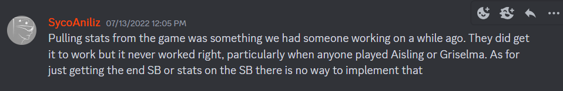
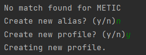

# Envy's Gaze
 OCR-based parser for Gigantic Scoreboards!

If you don't know what a "Gigantic Scoreboard" is, this project does not affect you and probably never will.

## What is it?
It's a way to find ways to justify that I'm better than people I don't like. It's also proof that there is nothing more motivating than being told that something is impossible.

*never say never*

It's basically a way of converting an image into a bunch of data, and then storing that data in a way that's usable.

## How do I use it?
There are four packages required (pandas, python-Levenshtein, opencv-python, pytesseract). Pytesseract has a few extra installation steps, so pay attention.

You also need to provide the directory of your tesseract files in the code (line 89, kdaFromScoreboard.py). You can also Ctrl+F for PATH_GOES_HERE.

It takes FULL SCREENCAPS of scoreboards (do NOT crop them) in the Unprocessed folder and moves them to the Processed folder afterwards.
To process a batch of scoreboards, just run addNewScoreboard.py.

While running it, you'll see a bunch of prompts asking about aliases and profiles.

If the name belongs to someone who's already in the system, create a new alias linking that name to the player.

If the name belongs to a player who's new to the system, create a new profile for the player entirely.

If you can't determine who the name belonged to, just say 'n' to both prompts. It will just redirect the stats to UNKNOWN instead.

I left an example of how to create a user and alias in the csv file, so reference that if you get stuck.

*adding a new player to the database*

## Is that it?
Yeah, pretty much. I also have a way to determine who won or lost the match based on the scoreboard,
 but I haven't found the time to add it. If people are actually using this, I'll get that intergrated. 